# PRD — LTI ATS (Kora)

**Documento:** Product Requirements Document v1.0  
**Producto:** Kora — _The hiring OS for growing teams_  
**Empresa:** LTI (Leadership. Technology. Impact)  
**Autor:** Carmen (cmcmp)  
**Fecha:** 24 de mayo de 2026  
**Estado:** Borrador para validación  
**Fuente:** [Sesión de diseño en Claude](https://claude.ai/share/dd697ad4-b250-4421-a18a-04ed23ddd2a8)

---

## 1. Resumen ejecutivo

LTI desarrolla **Kora**, un ATS (Applicant Tracking System) orientado a **startups y pymes (10–200 empleados)** cuyo diferenciador es una **IA híbrida (A+D)**: actúa como copiloto del reclutador y, al mismo tiempo, **aprende los procesos de la empresa para automatizarlos** sin configuración técnica compleja.

El producto se articula en **tres módulos core** interconectados por un motor central (**Kora Brain**):

| Módulo                          | Propósito                                                                            |
| ------------------------------- | ------------------------------------------------------------------------------------ |
| **Recruiting Autopilot**        | Generar el plan completo de contratación a partir de un objetivo en lenguaje natural |
| **Manager Collaboration Layer** | Integrar al hiring manager en el proceso sin fricción, fuera del ATS tradicional     |
| **Talent Pool Intelligence**    | Convertir cada candidato en un activo reutilizable de la empresa                     |

**Propuesta de valor:** Kora no solo gestiona el proceso de selección; lo **ejecuta junto al equipo** — generando planes, coordinando managers y enriqueciendo una base de talento propia que mejora con cada contratación.

---

## 2. Contexto y problema a resolver

### 2.1 Contexto de mercado

Las pymes con equipos de HR reducidos (1–3 reclutadores) contratan entre **5 y 50 posiciones al año**. No disponen de presupuesto ni tiempo para configurar workflows complejos ni para mantener un equipo de recruiting ops. Los ATS actuales (Greenhouse, Lever, Ashby, etc.) están evolucionando hacia IA generativa, pero siguen tratando al **hiring manager como ciudadano de segunda clase**.

### 2.2 Problema principal

**El 70% del tiempo de un reclutador en una pyme se consume en coordinación y tareas repetitivas**, no en recruiting de valor:

- Perseguir al manager para obtener feedback
- Redactar emails y job descriptions manualmente
- Mover candidatos de etapa en el pipeline
- Recordar el estado de cada proceso
- Perder candidatos por falta de seguimiento oportuno

### 2.3 Problemas secundarios

| Área                                  | Situación actual                                                                          | Impacto                                                              |
| ------------------------------------- | ----------------------------------------------------------------------------------------- | -------------------------------------------------------------------- |
| **Colaboración reclutador–manager**   | Feedback por WhatsApp, email suelto o conversación informal; decisiones fuera del sistema | Procesos de 2 semanas se alargan a 6; mejores candidatos se enfrían  |
| **Visibilidad del proceso**           | Nadie sabe el estado real de cada candidato cuando hay varios evaluadores                 | Retrabajo, duplicidad de comunicaciones, errores de coordinación     |
| **Base de talento**                   | Candidatos rechazados quedan olvidados; cada vacante exige búsqueda externa desde cero    | Coste elevado en portales; pérdida de inversión previa en evaluación |
| **Configuración de automatizaciones** | Editores visuales complejos (estilo Zapier) inaccesibles para equipos pequeños            | Automatización teórica pero no adoptada en la práctica               |

### 2.4 Oportunidad

Combinar **automatización de workflows end-to-end** con **IA generativa** permite que el sistema no solo ejecute reglas predefinidas, sino que **genere y adapte workflows** según el contexto de cada empresa y manager. Ese aprendizaje acumulado constituye un **foso competitivo** difícil de replicar por competidores que no tienen el historial de feedback real de la organización.

---

## 3. Objetivos del producto

### 3.1 Objetivo estratégico

Reducir drásticamente el trabajo manual del reclutador en pymes, mejorando simultáneamente la colaboración con hiring managers y la reutilización del talento ya evaluado.

### 3.2 Objetivos medibles (12 meses post-lanzamiento MVP)

| ID  | Objetivo                                     | Métrica                                                       | Meta                                           |
| --- | -------------------------------------------- | ------------------------------------------------------------- | ---------------------------------------------- |
| O1  | Reducir carga administrativa del reclutador  | % de tiempo en tareas administrativas vs. recruiting de valor | **−60%**                                       |
| O2  | Acelerar el ciclo de contratación            | Time-to-hire medio por posición                               | **3× más rápido** que la media del sector pyme |
| O3  | Activar el talent pool como fuente principal | % de contrataciones originadas en base propia                 | **≥ 40%** tras 12 meses de uso                 |
| O4  | Mejorar experiencia del hiring manager       | NPS del hiring manager                                        | **> 70** (vs. < 20 en ATS tradicionales)       |
| O5  | Aumentar adopción del módulo de colaboración | % de feedback de managers capturado dentro del sistema        | **≥ 85%**                                      |
| O6  | Reducir candidatos sin respuesta             | % de candidatos activos sin contacto > 48 h                   | **< 5%**                                       |

### 3.3 Objetivos de negocio

- Validar product-market fit en segmento pyme (10–200 empleados) en mercados hispanohablantes y europeos
- Alcanzar retención anual (Net Revenue Retention) > 110% gracias al efecto lock-in del Talent Pool
- Modelo de pricing alineado con valor: **por posiciones activas** (preferido sobre asientos para maximizar ACV en clientes con pocos reclutadores)

---

## 4. Usuarios y personas

| Persona                      | Rol                         | Necesidades clave                                                                       |
| ---------------------------- | --------------------------- | --------------------------------------------------------------------------------------- |
| **Reclutador/a**             | Usuario principal diario    | Automatizar tareas repetitivas, visibilidad del pipeline, menos persecución de managers |
| **Hiring Manager**           | Evaluador y decisor         | Dar feedback rápido sin aprender un ATS; información digerida y accionable              |
| **Head of People / HR Lead** | Comprador económico y admin | ROI visible, salud del proceso, cumplimiento normativo                                  |
| **Candidato**                | Usuario externo             | Comunicación transparente, tiempos de respuesta razonables                              |
| **Administrador LTI**        | Configuración tenant        | Integraciones, permisos, auditoría                                                      |

---

## 5. Alcance del MVP (v1.0)

### 5.1 In scope

- Recruiting Autopilot (generación de plan de contratación)
- Manager Collaboration Layer (vista lite, scorecards asistidos, nudges, hilo unificado)
- Talent Pool Intelligence (clasificación, matching y reactivación)
- Kora Brain (motor IA transversal con aprendizaje de criterios reales)
- Gestión básica de candidatos, posiciones y pipeline
- Integraciones: email, Slack (notificaciones y acciones), calendario
- Dashboard de salud del proceso (Hiring Health Score simplificado)

### 5.2 Out of scope (v1.0)

- Smart Inbox multicanal completo (WhatsApp, LinkedIn nativo)
- AI Interview Intelligence con transcripción en tiempo real
- Workflow Builder conversacional completo (solo reglas predefinidas + sugerencias IA)
- Analytics predictivos avanzados (requieren volumen de datos histórico)
- Publicación automática en >10 job boards
- Portal de candidato best-in-class (solo comunicaciones básicas)

---

## 6. User stories principales

### Epic 1 — Recruiting Autopilot

**US-01 — Generar plan de contratación**

> Como **reclutador**, quiero **describir el objetivo de contratación en lenguaje natural** para que **Kora genere automáticamente el plan completo** (job description, criterios de scoring, etapas, plantillas de email, calendario e evaluadores) en menos de 2 minutos.

**Criterios de aceptación:**

- El reclutador introduce objetivo, plazo, presupuesto y requisitos clave
- El sistema genera un plan editable con al menos: JD, pipeline de etapas, scorecard base y plantillas de comunicación
- El reclutador puede aprobar, modificar o regenerar cualquier elemento antes de activar
- Tiempo de generación < 120 segundos para el 95% de las solicitudes

---

**US-02 — Consultar talent pool antes de publicar**

> Como **reclutador**, quiero que **Kora busque candidatos en la base propia antes de publicar en portales externos** para **reducir coste y time-to-hire**.

**Criterios de aceptación:**

- Tras generar el plan, el sistema muestra automáticamente top N matches del talent pool (N configurable, default 10)
- Cada match incluye: score de afinidad, historial previo, última interacción y motivo del match
- El reclutador puede incorporar candidatos al pipeline con un clic
- Se registra el origen (pool vs. externo) para métricas O3

---

### Epic 2 — Manager Collaboration Layer

**US-03 — Feedback del manager sin login complejo**

> Como **hiring manager**, quiero **recibir un resumen del candidato en mi canal habitual** (Slack, email o enlace móvil) para **evaluarlo en menos de 2 minutos sin entrar al ATS**.

**Criterios de aceptación:**

- Notificación incluye: resumen IA del candidato, criterios del puesto, puntos clave a evaluar y acciones (Aprobar / Rechazar / Más info)
- Vista optimizada mobile-first, sin necesidad de cuenta completa (magic link autenticado)
- Feedback queda registrado en el pipeline automáticamente
- Tiempo medio de completar evaluación < 2 minutos (medido)

---

**US-04 — Scorecard prellenado por IA**

> Como **hiring manager**, quiero **recibir un scorecard ya completado por la IA** basado en la entrevista para **validar o corregir en 2 clics** en lugar de redactar desde cero.

**Criterios de aceptación:**

- Si existe transcripción o notas de entrevista, la IA pre-rellena scorecard según criterios del puesto
- El manager puede ajustar puntuaciones y comentarios antes de enviar
- Reducción medible del tiempo de feedback vs. formulario en blanco (> 80%)

---

**US-05 — Nudge inteligente con escalado**

> Como **reclutador**, quiero que **el sistema recuerde al manager con contexto de riesgo** cuando no responde a tiempo para **evitar que los candidatos se enfríen**.

**Criterios de aceptación:**

- Reglas configurables de SLA por etapa (default: 48 h primera notificación, 72 h escalado)
- Mensajes progresivos: suave → urgente → escalado al reclutador
- El nudge incluye contexto concreto (ej.: "Ana lleva 5 días esperando; tiene otra oferta")
- Canales: Slack y email como mínimo

---

**US-06 — Hilo unificado por candidato**

> Como **reclutador o manager**, quiero **ver todas las comunicaciones y notas sobre un candidato en un único hilo cronológico** para **eliminar la pregunta "¿dónde quedamos?"**.

**Criterios de aceptación:**

- El hilo agrega: emails del sistema, mensajes Slack vinculados, notas internas y feedback de evaluadores
- Búsqueda por candidato devuelve el hilo completo
- Permisos respetados: managers solo ven candidatos asignados

---

**US-07 — Decisión colectiva con anti-sesgo**

> Como **reclutador**, quiero que **cada evaluador introduzca su valoración de forma independiente** antes de ver la de los demás para **reducir el efecto de anclaje**.

**Criterios de aceptación:**

- Evaluaciones ocultas hasta que todos hayan completado o expire el plazo
- Panel consolidado visible solo tras cierre de ronda
- Registro de timestamp y autor por evaluación

---

### Epic 3 — Talent Pool Intelligence

**US-08 — Enriquecimiento automático del pool**

> Como **reclutador**, quiero que **cada candidato que pase por el proceso quede clasificado y enriquecido** aunque no sea contratado para **reutilizarlo en futuras vacantes**.

**Criterios de aceptación:**

- Al cerrar un proceso (contratado/rechazado/retirado), el perfil se actualiza con: skills inferidas, seniority, feedback agregado y etiquetas
- Consentimiento GDPR registrado para recontacto
- Búsqueda full-text y por filtros (skills, seniority, disponibilidad)

---

**US-09 — Matching proactivo al abrir posición**

> Como **reclutador**, quiero **recibir sugerencias automáticas del talent pool** cada vez que abro una posición para **priorizar candidatos ya evaluados**.

**Criterios de aceptación:**

- Al crear posición, Kora Brain calcula matches con score explicado
- Notificación al reclutador si hay matches con score > umbral configurable
- Historial de matches y acciones (contactado, descartado, incorporado)

---

**US-10 — Aprendizaje de preferencias del manager**

> Como **Head of People**, quiero que **Kora aprenda los criterios reales de cada manager** a partir del feedback histórico para **mejorar las sugerencias en futuros procesos**.

**Criterios de aceptación:**

- El sistema detecta patrones en aprobaciones/rechazos por manager (ej.: prioriza experiencia en startup vs. corporativo)
- Las sugerencias de Autopilot y Talent Pool incorporan preferencias aprendidas
- Explicabilidad: cada sugerencia indica qué señales influyeron en el score

---

### Epic 4 — Visibilidad y salud del proceso

**US-11 — Hiring Health Score**

> Como **Head of People**, quiero **un dashboard con la salud del proceso de contratación** para **detectar cuellos de botella y tomar acciones**.

**Criterios de aceptación:**

- Métrica compuesta: velocidad, calidad de candidatos, engagement del manager, tasa oferta/rechazo
- Alertas proactivas (ej.: "Proceso parado 3 semanas en fase técnica")
- Acciones sugeridas concretas, no solo datos

---

## 7. Requisitos funcionales

### 7.1 Módulo Recruiting Autopilot

| ID    | Requisito                                                      | Prioridad |
| ----- | -------------------------------------------------------------- | --------- |
| RF-01 | Crear posición a partir de objetivo en lenguaje natural        | Must      |
| RF-02 | Generar job description editable con tono configurable         | Must      |
| RF-03 | Generar pipeline de etapas con criterios de scoring            | Must      |
| RF-04 | Generar plantillas de email por etapa                          | Must      |
| RF-05 | Proponer calendario de entrevistas y asignación de evaluadores | Should    |
| RF-06 | Consultar talent pool antes de activar publicación externa     | Must      |
| RF-07 | Permitir aprobar/modificar/regenerar plan antes de activación  | Must      |

### 7.2 Módulo Manager Collaboration Layer

| ID    | Requisito                                               | Prioridad |
| ----- | ------------------------------------------------------- | --------- |
| RF-08 | Enviar notificaciones a managers vía Slack y email      | Must      |
| RF-09 | Vista lite mobile-first accesible por magic link        | Must      |
| RF-10 | Acciones rápidas: aprobar, rechazar, solicitar más info | Must      |
| RF-11 | Scorecard prellenado por IA desde transcripción/notas   | Should    |
| RF-12 | Nudges progresivos con contexto de riesgo y escalado    | Must      |
| RF-13 | Hilo unificado cronológico por candidato                | Must      |
| RF-14 | Evaluación ciega multi-evaluador con anti-sesgo         | Should    |
| RF-15 | Sincronización bidireccional básica con Slack           | Must      |

### 7.3 Módulo Talent Pool Intelligence

| ID    | Requisito                                                | Prioridad |
| ----- | -------------------------------------------------------- | --------- |
| RF-16 | Clasificación automática de candidatos al cerrar proceso | Must      |
| RF-17 | Enriquecimiento de perfil (skills, seniority, tags)      | Must      |
| RF-18 | Motor de matching con score explicado                    | Must      |
| RF-19 | Búsqueda y filtrado avanzado en talent pool              | Must      |
| RF-20 | Gestión de consentimiento y derecho al olvido (GDPR)     | Must      |
| RF-21 | Reactivación de candidatos con plantillas personalizadas | Should    |

### 7.4 Kora Brain (transversal)

| ID    | Requisito                                                     | Prioridad |
| ----- | ------------------------------------------------------------- | --------- |
| RF-22 | Aprendizaje de criterios reales por manager/empresa           | Must      |
| RF-23 | Explicabilidad de sugerencias y scores IA                     | Must      |
| RF-24 | Retroalimentación entre módulos (feedback → pool → autopilot) | Must      |
| RF-25 | Registro de interacciones IA para auditoría                   | Must      |

### 7.5 Funcionalidades ATS base

| ID    | Requisito                                       | Prioridad |
| ----- | ----------------------------------------------- | --------- |
| RF-26 | CRUD de candidatos con CV (PDF/DOCX)            | Must      |
| RF-27 | CRUD de posiciones y pipeline configurable      | Must      |
| RF-28 | Gestión de aplicaciones candidato–posición      | Must      |
| RF-29 | Historial de etapas y movimientos en pipeline   | Must      |
| RF-30 | Roles y permisos (reclutador, manager, admin)   | Must      |
| RF-31 | Integración calendario para agendar entrevistas | Should    |
| RF-32 | Exportación de datos (CSV)                      | Could     |

---

## 8. Requisitos no funcionales

### 8.1 Rendimiento y escalabilidad

| ID     | Requisito                    | Criterio                                                    |
| ------ | ---------------------------- | ----------------------------------------------------------- |
| RNF-01 | Tiempo de respuesta API      | p95 < 500 ms para operaciones CRUD                          |
| RNF-02 | Generación de plan Autopilot | < 120 s para el 95% de solicitudes                          |
| RNF-03 | Matching talent pool         | < 10 s para bases de hasta 10.000 perfiles                  |
| RNF-04 | Concurrencia                 | Soportar 50 usuarios simultáneos por tenant sin degradación |
| RNF-05 | Disponibilidad               | 99,5% uptime mensual (SLA MVP)                              |

### 8.2 Seguridad y cumplimiento

| ID     | Requisito           | Criterio                                                                     |
| ------ | ------------------- | ---------------------------------------------------------------------------- |
| RNF-06 | Protección de datos | Cumplimiento GDPR y LOPDGDD                                                  |
| RNF-07 | Cifrado             | TLS 1.3 en tránsito; AES-256 en reposo para datos sensibles                  |
| RNF-08 | Autenticación       | SSO opcional (SAML/OIDC); MFA para administradores                           |
| RNF-09 | Autorización        | RBAC con principio de mínimo privilegio                                      |
| RNF-10 | Auditoría           | Log inmutable de acciones críticas (acceso a CVs, decisiones, exportaciones) |
| RNF-11 | Retención           | Políticas configurables de retención y borrado de datos de candidatos        |

### 8.3 IA responsable

| ID     | Requisito          | Criterio                                                                     |
| ------ | ------------------ | ---------------------------------------------------------------------------- |
| RNF-12 | Transparencia      | Toda sugerencia IA incluye explicación de señales utilizadas                 |
| RNF-13 | Supervisión humana | Ninguna decisión de contratación/rechazo fully automated sin revisión humana |
| RNF-14 | Sesgo              | Monitorización periódica de disparidades en scores por grupos protegidos     |
| RNF-15 | Opt-out            | Candidatos pueden solicitar revisión humana sin scoring automático           |

### 8.4 Usabilidad y accesibilidad

| ID     | Requisito         | Criterio                                                             |
| ------ | ----------------- | -------------------------------------------------------------------- |
| RNF-16 | Onboarding        | Time-to-first-value < 30 min (primera posición creada con Autopilot) |
| RNF-17 | Manager Lite View | Usable en móvil; acciones completables en ≤ 3 taps                   |
| RNF-18 | Accesibilidad     | WCAG 2.1 nivel AA en interfaces web                                  |
| RNF-19 | Idiomas MVP       | Español e inglés                                                     |

### 8.5 Integraciones y operaciones

| ID     | Requisito         | Criterio                                                |
| ------ | ----------------- | ------------------------------------------------------- |
| RNF-20 | Integraciones MVP | Email (SMTP/OAuth), Slack, Google Calendar / Outlook    |
| RNF-21 | API pública       | REST documentada (OpenAPI 3.0) para extensiones futuras |
| RNF-22 | Multi-tenant      | Aislamiento lógico estricto entre organizaciones        |
| RNF-23 | Observabilidad    | Métricas, logs estructurados y trazas distribuidas      |
| RNF-24 | Backup            | RPO ≤ 1 h; RTO ≤ 4 h                                    |

---

## 9. Modelo de negocio (Lean Canvas — síntesis)

| Bloque                 | Contenido                                                                                                             |
| ---------------------- | --------------------------------------------------------------------------------------------------------------------- |
| **Problema**           | 70% del tiempo del reclutador en tareas administrativas; managers fuera del sistema; talento descartado desperdiciado |
| **Segmento**           | Pymes 10–200 empleados, 1–3 reclutadores, 5–50 contrataciones/año                                                     |
| **Propuesta de valor** | IA que ejecuta el proceso de hiring, no solo lo registra                                                              |
| **Solución**           | Autopilot + Collaboration Layer + Talent Pool + Kora Brain                                                            |
| **Ventaja injusta**    | Talent Pool + aprendizaje acumulado = lock-in ético basado en activo propio de datos                                  |
| **Canales**            | PLG (product-led growth) + contenido thought leadership + programa early adopters                                     |
| **Ingresos**           | SaaS por posiciones activas/mes (modelo preferido vs. asientos)                                                       |
| **Costes**             | Infraestructura cloud, APIs LLM, soporte onboarding                                                                   |
| **Métricas clave**     | Time-to-hire, % contrataciones desde pool, NPS manager, retención anual                                               |

---

## 10. Criterios de éxito

### 10.1 Criterios de éxito del producto (12 meses)

| Criterio                   | Indicador                                  | Umbral de éxito |
| -------------------------- | ------------------------------------------ | --------------- |
| Eficiencia operativa       | Reducción tiempo administrativo reclutador | ≥ 60%           |
| Velocidad de contratación  | Time-to-hire vs. benchmark pyme            | ≥ 3× mejora     |
| Activación del talent pool | % contrataciones desde base propia         | ≥ 40%           |
| Satisfacción del manager   | NPS hiring manager                         | > 70            |
| Adopción colaboración      | % feedback capturado en sistema            | ≥ 85%           |
| Calidad del pipeline       | % candidatos sin respuesta > 48 h          | < 5%            |

### 10.2 Criterios de éxito del MVP (90 días post-lanzamiento beta)

| Criterio           | Indicador                                             | Umbral      |
| ------------------ | ----------------------------------------------------- | ----------- |
| Activación         | Clientes beta que crean ≥ 1 posición con Autopilot    | ≥ 80%       |
| Retención beta     | Clientes activos semana 4                             | ≥ 70%       |
| Valor percibido    | Encuesta "Kora me ahorra tiempo significativo"        | ≥ 4/5       |
| Funcionalidad core | Plan Autopilot generado y aprobado sin soporte manual | ≥ 90% casos |
| Colaboración       | Managers que completan feedback vía Lite View         | ≥ 60%       |

### 10.3 Criterios de no-éxito (señales de pivot)

- NPS manager < 30 tras 3 meses de uso
- < 20% de reclutadores reutilizan Autopilot en segunda posición
- Time-to-hire no mejora > 25% vs. baseline del cliente
- Churn > 15% mensual en clientes beta

---

## 11. Dependencias, riesgos y mitigaciones

| Riesgo                                    | Impacto | Mitigación                                                           |
| ----------------------------------------- | ------- | -------------------------------------------------------------------- |
| Calidad inconsistente de outputs IA       | Alto    | Human-in-the-loop; regeneración; plantillas validadas                |
| Baja adopción del manager                 | Alto    | Lite View sin login; integración Slack nativa; nudges contextuales   |
| Datos insuficientes para matching inicial | Medio   | Enriquecimiento progresivo; valor desde primera contratación         |
| Competidores replican features IA         | Medio   | Foso en Talent Pool + aprendizaje acumulado por organización         |
| Cumplimiento GDPR en IA                   | Alto    | Consentimiento explícito; explicabilidad; DPO review pre-lanzamiento |
| Dependencia de APIs LLM                   | Medio   | Abstracción de proveedor; fallback a reglas deterministas            |

---

## 12. Roadmap propuesto (alto nivel)

| Fase                      | Duración   | Entregables                                                             |
| ------------------------- | ---------- | ----------------------------------------------------------------------- |
| **Fase 0 — Discovery**    | 4 semanas  | Validación PRD, prototipos Manager Lite View y Autopilot                |
| **Fase 1 — MVP Core**     | 12 semanas | ATS base + Autopilot + Collaboration (Slack/email) + Talent Pool básico |
| **Fase 2 — Beta cerrada** | 8 semanas  | 10–15 clientes pyme, métricas O1–O6, iteración                          |
| **Fase 3 — GA**           | 8 semanas  | Pricing, onboarding PLG, Hiring Health Score, integraciones calendario  |

---

## 13. Glosario

| Término                 | Definición                                                                     |
| ----------------------- | ------------------------------------------------------------------------------ |
| **Autopilot**           | Módulo que genera el plan completo de contratación a partir de un objetivo     |
| **Collaboration Layer** | Módulo que integra al hiring manager en el flujo sin fricción                  |
| **Kora Brain**          | Motor de IA compartido que aprende criterios reales y conecta los tres módulos |
| **Lite View**           | Vista ultraligera mobile-first para evaluación de candidatos por managers      |
| **Talent Pool**         | Base de candidatos enriquecida y reutilizable de la organización               |
| **Nudge inteligente**   | Recordatorio contextual con escalado progresivo ante falta de respuesta        |
| **Time-to-hire**        | Días desde apertura de posición hasta aceptación de oferta                     |

---

## 14. Aprobaciones

| Rol                             | Nombre | Fecha | Firma |
| ------------------------------- | ------ | ----- | ----- |
| Product Owner                   |        |       |       |
| Tech Lead                       |        |       |       |
| Head of People (cliente piloto) |        |       |       |

---

## 15. Casos de uso prioritarios (funcionalidad básica)

Los tres casos siguientes definen el **mínimo viable end-to-end** de Kora: sin ellos el producto no opera como ATS; con ellos el reclutador puede abrir una posición, ejecutar el proceso y capturar la decisión del manager dentro del sistema.

### 15.0 Resumen y criterio de priorización

| # | Caso de uso | Actor principal | Función en el MVP |
| - | ----------- | --------------- | ----------------- |
| **CU-01** | Gestionar posición, candidatos y pipeline | Reclutador | Base ATS (RF-26–RF-29): sin esto no hay proceso que orquestar |
| **CU-02** | Generar y activar plan (Recruiting Autopilot) | Reclutador | Diferenciador IA (US-01): time-to-first-value y menos trabajo manual |
| **CU-03** | Evaluar candidato (Lite View) | Hiring Manager | Cierra el ciclo (US-03): feedback dentro del sistema sin fricción |

**Criterio de selección:** los tres CU forman el flujo mínimo **abrir vacante → ejecutar proceso → obtener decisión del manager**, alineado con el alcance del MVP (§5.1) y con los dolores del §2 (tareas administrativas, managers fuera del ATS).

**Fuera del top 3 en esta fase:** *Talent Pool Intelligence* (US-02, US-08) aporta valor acumulativo pero depende de historial; el flujo anterior ya entrega valor desde la primera contratación.

### CU-01 — Gestionar posición, candidatos y pipeline

**Actor principal:** Reclutador  
**Descripción:** Crear y mantener posiciones abiertas, registrar candidatos (con CV), asociarlos a una vacante y moverlos por etapas del pipeline con historial auditable.  
**Por qué es prioritario:** Es la capa ATS indispensable (RF-26 a RF-29); sin ella no existe proceso que Autopilot ni la colaboración con managers puedan orquestar.  
**Resultado esperado:** Una posición activa con candidatos trazables, etapa actual visible y movimientos registrados para todo el equipo.

### CU-02 — Generar y activar plan de contratación (Recruiting Autopilot)

**Actor principal:** Reclutador  
**Descripción:** Describir el objetivo de contratación en lenguaje natural y recibir un plan editable (job description, etapas, scorecard base, plantillas de comunicación) que se aprueba o ajusta antes de activar la posición.  
**Por qué es prioritario:** Materializa el diferenciador del producto (US-01, RF-01 a RF-07) y cumple el time-to-first-value del onboarding (RNF-16).  
**Resultado esperado:** Plan de contratación listo en menos de 2 minutos, sin redacción manual desde cero, listo para ejecutar el proceso.

### CU-03 — Evaluar candidato desde canal ligero del manager

**Actor principal:** Hiring manager  
**Descripción:** Recibir un resumen del candidato por Slack, email o enlace móvil (magic link), completar la evaluación en menos de 2 minutos (aprobar / rechazar / más info) y que el feedback quede registrado automáticamente en el pipeline.  
**Por qué es prioritario:** Ataca el mayor dolor operativo (coordinación con managers fuera del sistema) y habilita la métrica O5 de adopción de colaboración (US-03, RF-08 a RF-10).  
**Resultado esperado:** Decisión del manager capturada en Kora sin login completo al ATS, sin persecución manual por parte del reclutador.

### 15.1 Modelo UML: diagrama de casos de uso

Para casos de uso a nivel de requisitos funcionales, el artefacto UML recomendado es el **diagrama de casos de uso** (*Use Case Diagram*, UML 2.5). Resume **quién** interactúa con el sistema, **qué objetivos** persigue y el **alcance** del producto, sin detallar flujos internos (eso corresponde a diagramas de actividad o secuencia en fases posteriores).

#### Elementos del modelo

| Elemento UML | Notación | Definición en Kora |
| ------------ | -------- | ------------------ |
| **Límite del sistema** | Rectángulo | Contenedor lógico **«Kora — ATS (MVP básico)»**: todo lo que el producto ofrece al usuario en esta versión mínima. |
| **Actor** | Silueta / `actor` | Rol externo que **inicia** o **recibe** interacciones con el sistema. Puede ser humano u otro sistema. |
| **Caso de uso** | Elipse / `(nombre)` | Unidad de comportamiento observable que aporta valor a un actor; nombre en forma **verbo + objeto** (infinitivo). |
| **Asociación** | Línea continua | Vínculo actor–caso de uso: el actor participa en esa funcionalidad. |
| **«include»** | Flecha punteada `-.->` | Subcomportamiento **obligatorio** reutilizado (el caso base no se completa sin él). |
| **«extend»** | Flecha punteada `-.->` | Subcomportamiento **opcional** que amplía un caso bajo condición (no modelado en el MVP básico). |

#### Actores

| Actor | Tipo | Descripción |
| ----- | ---- | ----------- |
| **Reclutador** | Primario | Usuario principal del ATS; crea posiciones, gestiona candidatos y activa planes generados por IA. |
| **Hiring Manager** | Primario | Evalúa candidatos y emite decisión sin adoptar el ATS completo. |
| **Kora Brain** | Secundario | Motor de IA que genera el plan de contratación a partir del objetivo en lenguaje natural (CU-02). |
| **Slack** | Secundario | Canal de notificación y acceso a la Lite View (CU-03). |
| **Servicio de email** | Secundario | Canal alternativo de notificación y magic link (CU-03). |

#### Casos de uso internos (reutilización)

| ID | Nombre | Descripción |
| -- | ------ | ----------- |
| **CU-02a** | Persistir plan y activar posición | Guarda JD, etapas, scorecard y plantillas; deja la posición en estado *activa* tras aprobación del reclutador. |
| **CU-03a** | Registrar feedback en pipeline | Persiste la decisión del manager (aprobar / rechazar / más info) y actualiza la etapa del candidato con trazabilidad. |

**Relaciones «include»:** CU-02 incluye CU-02a; CU-02a incluye CU-01 (no se activa un plan sin la estructura de posición/pipeline). CU-03 incluye CU-03a; CU-03a incluye la parte de CU-01 que actualiza el estado del candidato en el pipeline.

#### Diagrama de casos de uso (MVP básico)

```mermaid
useCaseDiagram
    title Diagrama de casos de uso — Kora ATS (funcionalidad básica)

    actor "Reclutador" as REC
    actor "Hiring Manager" as HM
    actor "Kora Brain" as KB
    actor Slack as SLK
    actor "Servicio de email" as EM

    rectangle "Kora — ATS (MVP básico)" {
        usecase "CU-01\nGestionar posición,\ncandidatos y pipeline" as UC1
        usecase "CU-02\nGenerar y activar plan\n(Recruiting Autopilot)" as UC2
        usecase "CU-03\nEvaluar candidato\n(Lite View)" as UC3
        usecase "CU-02a\nPersistir plan y\nactivar posición" as UC2a
        usecase "CU-03a\nRegistrar feedback\nen pipeline" as UC3a
    }

    REC --> UC1
    REC --> UC2
    HM --> UC3

    KB --> UC2

    UC2 ..> UC2a : <<include>>
    UC2a ..> UC1 : <<include>>
    UC3 ..> UC3a : <<include>>
    UC3a ..> UC1 : <<include>>

    UC3 --> SLK
    UC3 --> EM
```

#### Especificación resumida por caso de uso

| Campo | CU-01 | CU-02 | CU-03 |
| ----- | ----- | ----- | ----- |
| **Actores** | Reclutador | Reclutador, Kora Brain | Hiring Manager; Slack / Email (canales) |
| **Precondición** | Usuario autenticado con rol reclutador | Objetivo de contratación definido (texto + metadatos mínimos) | Candidato en etapa que requiere evaluación del manager; notificación enviada |
| **Flujo principal** | 1. Crear/editar posición → 2. Registrar candidato y CV → 3. Asociar a posición → 4. Mover entre etapas | 1. Introducir objetivo en lenguaje natural → 2. Kora Brain genera plan → 3. Reclutador revisa/edita → 4. Aprueba → (include CU-02a → CU-01) | 1. Manager abre resumen (Slack/email/link) → 2. Revisa candidato → 3. Elige acción → (include CU-03a → actualización en CU-01) |
| **Postcondición** | Pipeline consistente con historial de movimientos | Posición activa con plan persistido | Feedback registrado; etapa del candidato actualizada |
| **Excepción relevante** | Movimiento inválido de etapa → rechazo con mensaje | Timeout o error de IA → regeneración o edición manual | Enlace expirado → reenvío de magic link por reclutador |

#### Notas de modelado

- Los tres CU de negocio (CU-01 a CU-03) son **visibles para stakeholders**; CU-02a y CU-03a son **casos de uso internos** que evitan duplicar lógica de persistencia en el diagrama.
- **CU-01 no incluye CU-02:** el reclutador puede operar el ATS de forma manual; Autopilot es una vía acelerada, no un prerrequisito obligatorio del sistema completo.
- Diagramas de **actividad** o **secuencia** por CU se recomiendan en la fase de diseño técnico (Fase 0 / Fase 1 del roadmap), cuando se detallen integraciones Slack, email y APIs de Kora Brain.

### 15.2 Vista simplificada de relaciones «include»

Diagrama reducido para revisión rápida de dependencias entre casos de uso (sin actores secundarios):

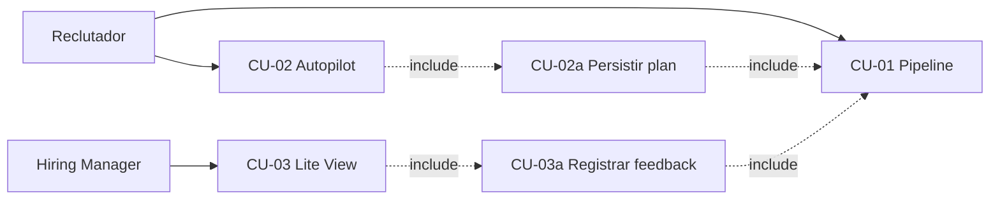

### 15.3 Representación alternativa (PlantUML)

Equivalente UML 2.5 para herramientas que no renderizan `useCaseDiagram` de Mermaid (PlantUML, IntelliJ, VS Code con extensión PlantUML):

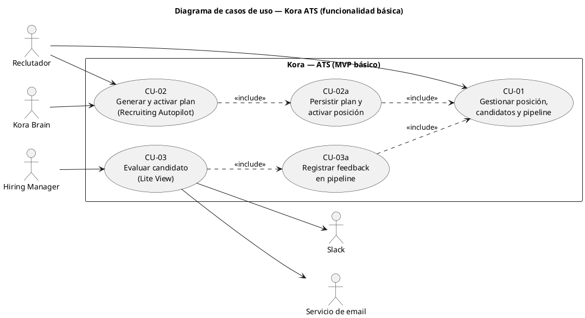

---

## 16. Modelo de datos

Modelo lógico orientado a **PostgreSQL** para el MVP de Kora (§5.1, §7, §15). Cubre multi-tenant (RNF-22), ATS base (RF-26–RF-30), Recruiting Autopilot (RF-01–RF-07), Manager Collaboration (RF-08–RF-15), Talent Pool (RF-16–RF-21) y trazabilidad de Kora Brain (RF-22–RF-25).

### 16.1 Convenciones

| Convención | Descripción |
| ---------- | ----------- |
| **PK** | Clave primaria `UUID` (v4), salvo tablas de unión simples |
| **FK** | Clave foránea `UUID` con índice; `ON DELETE` restrictivo por defecto en entidades de negocio |
| **Tipos** | `VARCHAR(n)`, `TEXT`, `INTEGER`, `DECIMAL(p,s)`, `BOOLEAN`, `DATE`, `TIMESTAMPTZ`, `JSONB`, `ENUM` (tipo enumerado nativo o `VARCHAR` + check) |
| **Auditoría** | `created_at` y `updated_at` en entidades mutables; historial explícito donde el PRD lo exige (RF-29, RNF-10) |
| **Aislamiento** | Toda entidad de negocio incluye `organization_id` o se alcanza por FK desde `Organization` |

### 16.2 Diagrama entidad–relación (visión global)

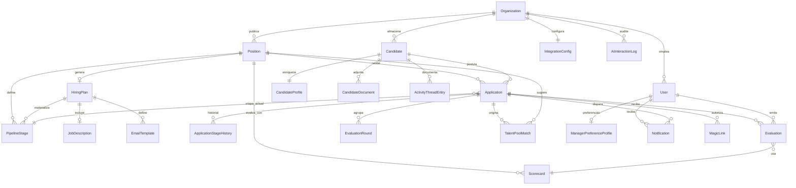

### 16.3 Entidades y atributos

#### Dominio: organización y acceso

**Organization** — Tenant (RNF-22).

| Atributo | Tipo | Descripción |
| -------- | ---- | ----------- |
| `id` | UUID | PK |
| `name` | VARCHAR(255) | Nombre legal o comercial |
| `slug` | VARCHAR(100) | Identificador único URL; UNIQUE |
| `locale_default` | VARCHAR(10) | Idioma por defecto (`es`, `en`) — RNF-19 |
| `settings` | JSONB | Configuración tenant (umbrales matching, tono IA, etc.) |
| `created_at` | TIMESTAMPTZ | Alta |
| `updated_at` | TIMESTAMPTZ | Última modificación |

**User** — Usuarios internos (RF-30).

| Atributo | Tipo | Descripción |
| -------- | ---- | ----------- |
| `id` | UUID | PK |
| `organization_id` | UUID | FK → Organization |
| `email` | VARCHAR(320) | UNIQUE por organización |
| `full_name` | VARCHAR(255) | Nombre visible |
| `role` | ENUM | `recruiter`, `hiring_manager`, `head_of_people`, `admin` |
| `auth_subject` | VARCHAR(255) | Identificador SSO/OIDC; nullable |
| `slack_user_id` | VARCHAR(64) | ID Slack para notificaciones; nullable |
| `is_active` | BOOLEAN | Cuenta habilitada |
| `created_at` | TIMESTAMPTZ | Alta |
| `updated_at` | TIMESTAMPTZ | Última modificación |

**IntegrationConfig** — Integraciones por tenant (RNF-20, RF-15).

| Atributo | Tipo | Descripción |
| -------- | ---- | ----------- |
| `organization_id` | UUID | PK, FK → Organization |
| `slack_team_id` | VARCHAR(64) | Workspace Slack; nullable |
| `slack_channel_default` | VARCHAR(128) | Canal por defecto; nullable |
| `email_from_address` | VARCHAR(320) | Remitente SMTP/OAuth |
| `calendar_provider` | ENUM | `google`, `outlook`, `none` |
| `calendar_connected` | BOOLEAN | Estado de conexión |
| `secrets_ref` | VARCHAR(128) | Referencia a vault (no almacenar tokens en claro) |
| `updated_at` | TIMESTAMPTZ | Última sincronización de config |

---

#### Dominio: posición, pipeline y Autopilot

**Position** — Vacante / proceso de contratación (RF-27, CU-01, CU-02).

| Atributo | Tipo | Descripción |
| -------- | ---- | ----------- |
| `id` | UUID | PK |
| `organization_id` | UUID | FK → Organization |
| `title` | VARCHAR(255) | Título del puesto |
| `status` | ENUM | `draft`, `plan_pending`, `active`, `closed`, `cancelled` |
| `department` | VARCHAR(128) | Departamento; nullable |
| `location` | VARCHAR(255) | Ubicación o remoto; nullable |
| `headcount` | INTEGER | Plazas a cubrir; default 1 |
| `budget_max` | DECIMAL(12,2) | Presupuesto máximo; nullable |
| `target_hire_date` | DATE | Fecha objetivo; nullable |
| `created_by_user_id` | UUID | FK → User |
| `owner_recruiter_id` | UUID | FK → User; reclutador responsable |
| `activated_at` | TIMESTAMPTZ | Activación tras aprobar plan; nullable |
| `closed_at` | TIMESTAMPTZ | Cierre del proceso; nullable |
| `created_at` | TIMESTAMPTZ | Alta |
| `updated_at` | TIMESTAMPTZ | Última modificación |

**PipelineStage** — Etapas del pipeline por posición (RF-03, RF-27, RF-29).

| Atributo | Tipo | Descripción |
| -------- | ---- | ----------- |
| `id` | UUID | PK |
| `position_id` | UUID | FK → Position |
| `name` | VARCHAR(128) | Nombre de etapa (ej. «Entrevista técnica») |
| `sort_order` | INTEGER | Orden en el pipeline |
| `stage_kind` | ENUM | `sourced`, `screening`, `interview`, `offer`, `hired`, `rejected` |
| `requires_manager_review` | BOOLEAN | Dispara CU-03 / notificaciones |
| `sla_hours_first_nudge` | INTEGER | SLA primera notificación (default 48) — US-05 |
| `sla_hours_escalation` | INTEGER | SLA escalado (default 72) |
| `created_at` | TIMESTAMPTZ | Alta |

**HiringPlan** — Plan generado por Recruiting Autopilot (RF-01, RF-07, CU-02).

| Atributo | Tipo | Descripción |
| -------- | ---- | ----------- |
| `id` | UUID | PK |
| `position_id` | UUID | FK → Position |
| `version` | INTEGER | Versión del plan (regeneraciones) |
| `status` | ENUM | `generating`, `draft`, `approved`, `archived` |
| `objective_text` | TEXT | Objetivo en lenguaje natural (entrada US-01) |
| `deadline` | DATE | Plazo indicado por reclutador; nullable |
| `budget` | DECIMAL(12,2) | Presupuesto del plan; nullable |
| `key_requirements` | JSONB | Requisitos clave estructurados |
| `ai_model` | VARCHAR(64) | Modelo LLM utilizado |
| `generated_at` | TIMESTAMPTZ | Fin de generación |
| `approved_by_user_id` | UUID | FK → User; nullable |
| `approved_at` | TIMESTAMPTZ | Aprobación; nullable |
| `created_at` | TIMESTAMPTZ | Alta |

**JobDescription** — JD editable (RF-02).

| Atributo | Tipo | Descripción |
| -------- | ---- | ----------- |
| `id` | UUID | PK |
| `hiring_plan_id` | UUID | FK → HiringPlan |
| `content` | TEXT | Cuerpo del JD (Markdown/HTML) |
| `tone` | ENUM | `formal`, `casual`, `startup`; nullable |
| `is_current` | BOOLEAN | Versión activa del plan |
| `created_at` | TIMESTAMPTZ | Alta |

**EmailTemplate** — Plantillas por etapa (RF-04).

| Atributo | Tipo | Descripción |
| -------- | ---- | ----------- |
| `id` | UUID | PK |
| `hiring_plan_id` | UUID | FK → HiringPlan |
| `pipeline_stage_id` | UUID | FK → PipelineStage; nullable hasta activar |
| `name` | VARCHAR(128) | Nombre interno de la plantilla |
| `subject` | VARCHAR(500) | Asunto del email |
| `body` | TEXT | Cuerpo con variables (`{{candidate_name}}`, etc.) |
| `created_at` | TIMESTAMPTZ | Alta |

**Scorecard** — Criterios de evaluación por posición (RF-03, US-04, US-07).

| Atributo | Tipo | Descripción |
| -------- | ---- | ----------- |
| `id` | UUID | PK |
| `position_id` | UUID | FK → Position |
| `version` | INTEGER | Versión del scorecard |
| `criteria` | JSONB | Array de criterios `{ id, label, weight, scale }` |
| `is_active` | BOOLEAN | Versión en uso |
| `created_at` | TIMESTAMPTZ | Alta |

---

#### Dominio: candidatos y talent pool

**Candidate** — Persona en el ATS / talent pool (RF-26, RF-16, US-08).

| Atributo | Tipo | Descripción |
| -------- | ---- | ----------- |
| `id` | UUID | PK |
| `organization_id` | UUID | FK → Organization |
| `email` | VARCHAR(320) | UNIQUE por organización |
| `first_name` | VARCHAR(128) | Nombre |
| `last_name` | VARCHAR(128) | Apellidos |
| `phone` | VARCHAR(32) | Teléfono; nullable |
| `linkedin_url` | VARCHAR(512) | Perfil LinkedIn; nullable |
| `gdpr_consent_status` | ENUM | `pending`, `granted`, `withdrawn` — RF-20 |
| `gdpr_consent_at` | TIMESTAMPTZ | Fecha de consentimiento; nullable |
| `gdpr_consent_source` | VARCHAR(64) | Origen del consentimiento; nullable |
| `anonymized_at` | TIMESTAMPTZ | Derecho al olvido aplicado; nullable |
| `created_at` | TIMESTAMPTZ | Alta |
| `updated_at` | TIMESTAMPTZ | Última modificación |

**CandidateProfile** — Enriquecimiento Talent Pool (RF-17, US-08).

| Atributo | Tipo | Descripción |
| -------- | ---- | ----------- |
| `candidate_id` | UUID | PK, FK → Candidate |
| `seniority` | ENUM | `junior`, `mid`, `senior`, `lead`, `executive`; nullable |
| `skills` | JSONB | Skills inferidas o declaradas |
| `tags` | JSONB | Etiquetas de clasificación |
| `availability_status` | ENUM | `available`, `passive`, `not_looking`; nullable |
| `aggregated_feedback` | TEXT | Resumen de feedback histórico |
| `last_enriched_at` | TIMESTAMPTZ | Último enriquecimiento IA |

**CandidateDocument** — CV y adjuntos (RF-26).

| Atributo | Tipo | Descripción |
| -------- | ---- | ----------- |
| `id` | UUID | PK |
| `candidate_id` | UUID | FK → Candidate |
| `file_name` | VARCHAR(255) | Nombre original |
| `file_type` | ENUM | `pdf`, `docx` |
| `storage_key` | VARCHAR(512) | Ruta/objeto en almacenamiento cifrado |
| `file_size_bytes` | INTEGER | Tamaño |
| `parsed_text` | TEXT | Texto extraído para búsqueda/IA; nullable |
| `uploaded_by_user_id` | UUID | FK → User |
| `uploaded_at` | TIMESTAMPTZ | Fecha de subida |

---

#### Dominio: aplicaciones y pipeline operativo

**Application** — Relación candidato–posición (RF-28, CU-01, CU-03).

| Atributo | Tipo | Descripción |
| -------- | ---- | ----------- |
| `id` | UUID | PK |
| `candidate_id` | UUID | FK → Candidate |
| `position_id` | UUID | FK → Position |
| `current_stage_id` | UUID | FK → PipelineStage |
| `status` | ENUM | `active`, `hired`, `rejected`, `withdrawn` |
| `source` | ENUM | `talent_pool`, `external`, `referral`, `direct` — US-02, O3 |
| `origin_match_id` | UUID | FK → TalentPoolMatch; nullable |
| `assigned_recruiter_id` | UUID | FK → User |
| `manager_summary_ai` | TEXT | Resumen IA para Lite View; nullable |
| `created_at` | TIMESTAMPTZ | Alta en pipeline |
| `updated_at` | TIMESTAMPTZ | Último cambio de estado |

**ApplicationStageHistory** — Historial de movimientos (RF-29, RNF-10).

| Atributo | Tipo | Descripción |
| -------- | ---- | ----------- |
| `id` | UUID | PK |
| `application_id` | UUID | FK → Application |
| `from_stage_id` | UUID | FK → PipelineStage; nullable (alta inicial) |
| `to_stage_id` | UUID | FK → PipelineStage |
| `moved_by_user_id` | UUID | FK → User; nullable si movimiento automático |
| `trigger` | ENUM | `manual`, `manager_decision`, `system`, `autopilot` |
| `reason` | TEXT | Motivo opcional |
| `moved_at` | TIMESTAMPTZ | Timestamp del movimiento |

**TalentPoolMatch** — Matching con score explicado (RF-18, US-02, US-09).

| Atributo | Tipo | Descripción |
| -------- | ---- | ----------- |
| `id` | UUID | PK |
| `position_id` | UUID | FK → Position |
| `candidate_id` | UUID | FK → Candidate |
| `match_score` | DECIMAL(5,2) | Score 0–100 |
| `explanation` | JSONB | Señales y motivo (RF-23) |
| `status` | ENUM | `suggested`, `contacted`, `dismissed`, `incorporated` |
| `action_by_user_id` | UUID | FK → User; nullable |
| `action_at` | TIMESTAMPTZ | Acción del reclutador; nullable |
| `created_at` | TIMESTAMPTZ | Cálculo del match |

---

#### Dominio: colaboración con managers

**EvaluationRound** — Ronda de evaluación ciega (US-07, RF-14).

| Atributo | Tipo | Descripción |
| -------- | ---- | ----------- |
| `id` | UUID | PK |
| `application_id` | UUID | FK → Application |
| `pipeline_stage_id` | UUID | FK → PipelineStage |
| `status` | ENUM | `open`, `closed` |
| `closes_at` | TIMESTAMPTZ | Cierre automático de ronda |
| `revealed_at` | TIMESTAMPTZ | Momento en que se muestran evaluaciones |
| `created_at` | TIMESTAMPTZ | Apertura |

**Evaluation** — Feedback / scorecard (CU-03, RF-10, RF-11, US-04).

| Atributo | Tipo | Descripción |
| -------- | ---- | ----------- |
| `id` | UUID | PK |
| `application_id` | UUID | FK → Application |
| `evaluation_round_id` | UUID | FK → EvaluationRound; nullable |
| `scorecard_id` | UUID | FK → Scorecard |
| `evaluator_user_id` | UUID | FK → User |
| `decision` | ENUM | `approve`, `reject`, `more_info` — RF-10 |
| `scores` | JSONB | Puntuaciones por criterio |
| `comments` | TEXT | Comentarios libres |
| `ai_prefilled` | BOOLEAN | Pre-relleno por IA (RF-11) |
| `submitted_via` | ENUM | `ats`, `lite_view`, `slack`, `email` |
| `submitted_at` | TIMESTAMPTZ | Envío del feedback |

**MagicLink** — Acceso Lite View sin login completo (RF-09, CU-03).

| Atributo | Tipo | Descripción |
| -------- | ---- | ----------- |
| `id` | UUID | PK |
| `token_hash` | VARCHAR(128) | Hash del token (nunca el token en claro) |
| `application_id` | UUID | FK → Application |
| `user_id` | UUID | FK → User (manager); nullable |
| `purpose` | ENUM | `lite_view_evaluation` |
| `expires_at` | TIMESTAMPTZ | Caducidad |
| `used_at` | TIMESTAMPTZ | Primer uso; nullable |
| `created_at` | TIMESTAMPTZ | Generación |

**Notification** — Notificaciones y nudges (RF-08, RF-12, US-05).

| Atributo | Tipo | Descripción |
| -------- | ---- | ----------- |
| `id` | UUID | PK |
| `organization_id` | UUID | FK → Organization |
| `recipient_user_id` | UUID | FK → User |
| `application_id` | UUID | FK → Application; nullable |
| `channel` | ENUM | `email`, `slack` |
| `notification_type` | ENUM | `manager_review`, `nudge_soft`, `nudge_urgent`, `nudge_escalation`, `match_alert` |
| `escalation_level` | INTEGER | 0 = inicial; incrementa con escalado |
| `context_payload` | JSONB | Contexto de riesgo para el nudge |
| `status` | ENUM | `pending`, `sent`, `delivered`, `opened`, `completed`, `failed` |
| `external_message_id` | VARCHAR(255) | ID en Slack/email; nullable |
| `scheduled_at` | TIMESTAMPTZ | Envío programado |
| `sent_at` | TIMESTAMPTZ | Envío efectivo; nullable |

**ActivityThreadEntry** — Hilo unificado por candidato (RF-13, US-06).

| Atributo | Tipo | Descripción |
| -------- | ---- | ----------- |
| `id` | UUID | PK |
| `candidate_id` | UUID | FK → Candidate |
| `application_id` | UUID | FK → Application; nullable |
| `author_user_id` | UUID | FK → User; nullable (sistema) |
| `entry_type` | ENUM | `email`, `slack`, `note`, `evaluation`, `system`, `ai_summary` |
| `content` | TEXT | Cuerpo o resumen |
| `metadata` | JSONB | IDs externos, adjuntos, referencias |
| `created_at` | TIMESTAMPTZ | Orden cronológico del hilo |

---

#### Dominio: Kora Brain e IA

**AiInteractionLog** — Auditoría de interacciones IA (RF-25, RNF-10).

| Atributo | Tipo | Descripción |
| -------- | ---- | ----------- |
| `id` | UUID | PK |
| `organization_id` | UUID | FK → Organization |
| `user_id` | UUID | FK → User; nullable |
| `interaction_type` | ENUM | `plan_generation`, `match_scoring`, `scorecard_prefill`, `candidate_summary`, `manager_preference` |
| `entity_type` | VARCHAR(64) | Entidad relacionada (`HiringPlan`, `Application`, etc.) |
| `entity_id` | UUID | ID de la entidad relacionada |
| `input_snapshot` | JSONB | Entrada (sin PII sensible si aplica política) |
| `output_snapshot` | JSONB | Salida generada |
| `model` | VARCHAR(64) | Identificador del modelo |
| `latency_ms` | INTEGER | Duración |
| `created_at` | TIMESTAMPTZ | Registro |

**ManagerPreferenceProfile** — Aprendizaje de preferencias (RF-22, US-10).

| Atributo | Tipo | Descripción |
| -------- | ---- | ----------- |
| `id` | UUID | PK |
| `organization_id` | UUID | FK → Organization |
| `user_id` | UUID | FK → User (hiring manager) |
| `learned_signals` | JSONB | Patrones detectados (ej. preferencia startup vs. corporate) |
| `sample_size` | INTEGER | Número de evaluaciones usadas |
| `last_trained_at` | TIMESTAMPTZ | Última actualización del modelo |
| `updated_at` | TIMESTAMPTZ | Última modificación |

---

### 16.4 Relaciones (cardinalidad)

| Relación | Cardinalidad | Regla de negocio |
| -------- | ------------ | ---------------- |
| Organization → User | 1:N | Un tenant tiene muchos usuarios; email único por org |
| Organization → Position | 1:N | Muchas vacantes activas o históricas |
| Organization → Candidate | 1:N | Talent pool por empresa |
| Position → PipelineStage | 1:N | Pipeline configurable por vacante |
| Position → HiringPlan | 1:N | Varias versiones; una `approved` activa el plan |
| HiringPlan → JobDescription | 1:N | Varias versiones; una `is_current` |
| HiringPlan → EmailTemplate | 1:N | Plantillas ligadas al plan |
| Position → Scorecard | 1:N | Versionado; una activa por posición |
| Candidate → CandidateProfile | 1:1 | Perfil enriquecido tras procesos |
| Candidate → CandidateDocument | 1:N | Múltiples CV/versiones |
| Candidate + Position → Application | N:M | Resuelto por entidad Application; UNIQUE `(candidate_id, position_id)` |
| Application → ApplicationStageHistory | 1:N | Historial append-only |
| Application → Evaluation | 1:N | Múltiples evaluadores y rondas |
| Application → EvaluationRound | 1:N | Rondas por etapa |
| Position + Candidate → TalentPoolMatch | N:M | Resuelto por TalentPoolMatch |
| Application → Notification | 1:N | Varias notificaciones/nudges |
| Application → MagicLink | 1:N | Enlaces renovables; validar `expires_at` |
| Candidate → ActivityThreadEntry | 1:N | Hilo a nivel candidato; opcionalmente por Application |
| Organization → AiInteractionLog | 1:N | Trazabilidad transversal |
| User → ManagerPreferenceProfile | 1:1 | Un perfil de preferencias por manager |

### 16.5 Índices y restricciones recomendadas

| Índice / restricción | Entidad | Motivo |
| -------------------- | ------- | ------ |
| `UNIQUE (organization_id, email)` | User, Candidate | Multi-tenant + unicidad |
| `UNIQUE (candidate_id, position_id)` | Application | Una aplicación activa por par |
| `INDEX (position_id, status)` | Application | Listados de pipeline |
| `INDEX (organization_id, match_score DESC)` | TalentPoolMatch | Top N matches (RF-18, RNF-03) |
| `INDEX (candidate_id, created_at)` | ActivityThreadEntry | Hilo cronológico (RF-13) |
| `INDEX (application_id, moved_at)` | ApplicationStageHistory | Historial y auditoría |
| `GIN (skills)`, `GIN (tags)` | CandidateProfile | Búsqueda y filtros (RF-19) |
| `CHECK (match_score BETWEEN 0 AND 100)` | TalentPoolMatch | Score válido |

### 16.6 Trazabilidad con requisitos y casos de uso

| Requisito / CU | Entidades principales |
| -------------- | --------------------- |
| CU-01, RF-26–RF-29 | `Candidate`, `CandidateDocument`, `Position`, `PipelineStage`, `Application`, `ApplicationStageHistory` |
| CU-02, RF-01–RF-07 | `HiringPlan`, `JobDescription`, `EmailTemplate`, `PipelineStage`, `Scorecard` |
| CU-03, RF-08–RF-10 | `Evaluation`, `MagicLink`, `Notification`, `Application` |
| US-05, RF-12 | `Notification`, `PipelineStage.sla_*` |
| US-06, RF-13 | `ActivityThreadEntry` |
| US-07, RF-14 | `EvaluationRound`, `Evaluation` |
| US-08–US-09, RF-16–RF-19 | `CandidateProfile`, `TalentPoolMatch` |
| RF-20 | `Candidate.gdpr_*`, `anonymized_at` |
| RF-22–RF-25 | `ManagerPreferenceProfile`, `AiInteractionLog`, `TalentPoolMatch.explanation` |

### 16.7 Notas de implementación

- **PositionAssignment:** evaluadores por posición (RF-05) puede modelarse como tabla `PositionEvaluator (position_id, user_id, role)` en Fase 1; no bloquea el MVP básico de §15.
- **Hiring Health Score (US-11):** métricas derivadas por vistas materializadas o agregaciones sobre `Application`, `ApplicationStageHistory` y `Notification`; no requiere entidad persistente en v1.
- **Calendario (RF-31):** entidad `InterviewEvent` diferida; `IntegrationConfig.calendar_*` prepara el modelo.
- Los campos `JSONB` (`criteria`, `explanation`, `learned_signals`) permiten evolución sin migraciones frecuentes, manteniendo esquema validado en aplicación.

---

## 17. Arquitectura de alto nivel

Arquitectura objetivo para el **MVP v1.0** de Kora (§5.1, §7, §8, §15, §16), alineada con pymes multi-tenant (RNF-22), integraciones Slack/email (RNF-20), rendimiento CRUD (RNF-01) y generación IA asíncrona (RNF-02).

### 17.1 Principios y decisiones arquitectónicas

| Principio | Decisión | Justificación |
| --------- | -------- | ------------- |
| **Time-to-market** | Monolito modular desplegable como un solo artefacto | Roadmap Fase 1 (12 semanas); equipo pequeño; reduce complejidad operativa |
| **Aislamiento por dominio** | Módulos acoplados por interfaces, no por base de datos compartida indiscriminada | Refleja los tres módulos de producto + Kora Brain; facilita extraer microservicios en Fase 3 |
| **Multi-tenant** | `organization_id` en todas las consultas; filtro en capa de persistencia | RNF-22; evita fugas entre tenants |
| **IA desacoplada** | Kora Brain como capa de orquestación + cola de trabajos | RNF-02 (< 120 s); no bloquea API síncrona; abstracción de proveedor LLM (RF-25, riesgo §11) |
| **Eventos para automatización** | Cola + workers para notificaciones, nudges y enriquecimiento | US-05, RF-12; SLA por etapa sin polling agresivo |
| **Seguridad por capas** | API Gateway → Auth → RBAC → dominio | RNF-08, RNF-09; magic links con alcance mínimo (RF-09) |
| **Observabilidad** | Logs estructurados, métricas y trazas desde día 1 | RNF-23; auditoría `AiInteractionLog` |

**Estilo arquitectónico:** *Modular monolith* con **workers asíncronos** y **almacenamiento gestionado** (PostgreSQL, Redis, object storage). Evolución prevista hacia servicios independientes cuando el volumen de tenants o el equipo lo justifique (Fase 3 GA).

### 17.2 Vista de contexto (C4 — Nivel 1)

Sistema Kora en su entorno: actores humanos, sistemas externos e integraciones del MVP.

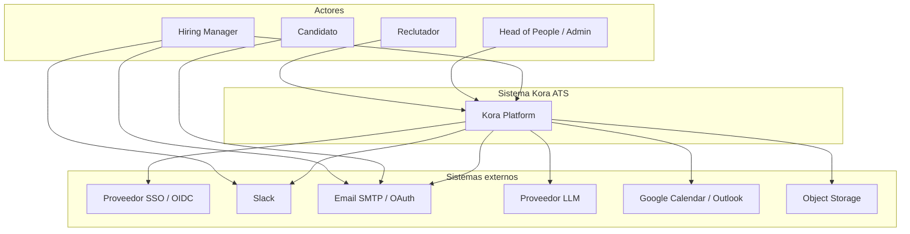

| Interacción | Descripción |
| ----------- | ----------- |
| Reclutador / Head of People | Aplicación web completa (pipeline, Autopilot, talent pool, dashboard) |
| Hiring Manager | Lite View vía navegador; notificaciones y acciones en Slack/email |
| Candidato | Emails transaccionales (comunicaciones básicas §5.2); sin portal avanzado en v1 |
| SSO/OIDC | Autenticación de usuarios internos (RNF-08) |
| Slack / Email | Notificaciones, nudges, magic links (RF-08, RF-15) |
| LLM | Generación de planes, resúmenes, matching explicado, pre-relleno scorecard |
| Object Storage | CVs cifrados en reposo (RNF-07, RF-26) |

### 17.3 Vista de contenedores (C4 — Nivel 2)

Contenedores ejecutables y responsabilidades. La API expone REST OpenAPI 3.0 (RNF-21).

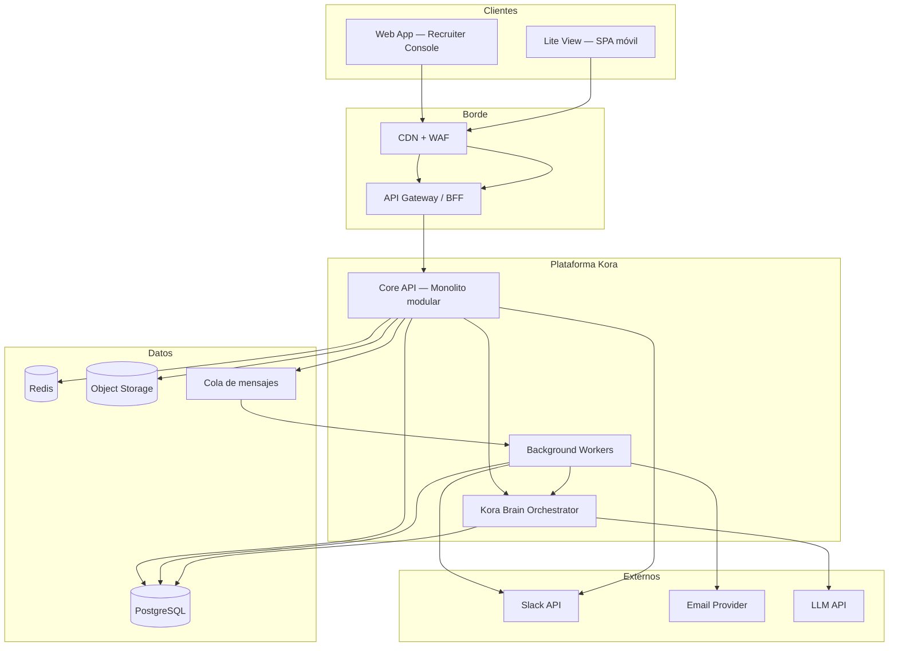

| Contenedor | Tecnología sugerida | Responsabilidad |
| ---------- | ------------------- | ----------------- |
| **Web App** | React/Next.js o similar | UI reclutador, Head of People, admin; i18n es/en |
| **Lite View** | React ligero o rutas dedicadas en Next | CU-03; mobile-first; magic link (RF-09) |
| **API Gateway / BFF** | Kong, AWS API GW o reverse proxy (nginx) | TLS, rate limiting, routing, correlación de trazas |
| **Core API** | Node.js (NestJS) o Java (Spring Boot) | CRUD ATS, RBAC, orquestación síncrona de dominio |
| **Kora Brain Orchestrator** | Módulo interno o sidecar | Prompts, RAG tenant, llamadas LLM, logging RF-25 |
| **Background Workers** | Mismo runtime o proceso separado | Autopilot jobs, matching, nudges, enriquecimiento pool |
| **PostgreSQL** | RDS / Cloud SQL | Modelo §16; transacciones ACID |
| **Redis** | ElastiCache / Memorystore | Sesiones, cache matching, locks SLA |
| **Object Storage** | S3 / GCS | `CandidateDocument`; cifrado AES-256 |
| **Cola** | Redis Streams, SQS o RabbitMQ | Desacoplar IA y notificaciones |

### 17.4 Módulos de dominio (vista de componentes)

Dentro del **Core API**, los módulos mapean al producto y al modelo de datos (§16):

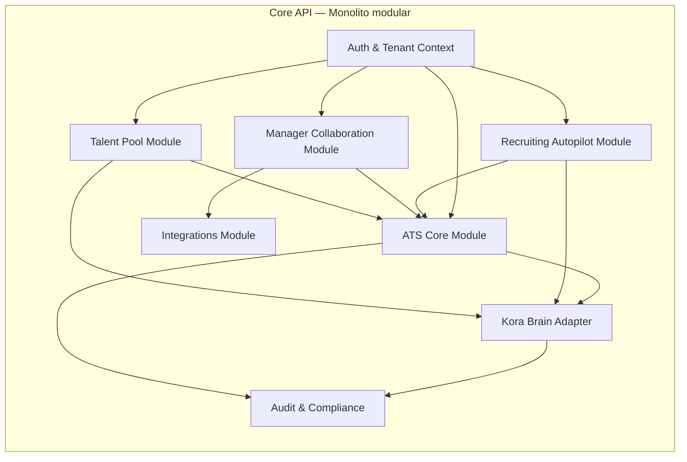

| Módulo | Casos de uso / RF | Entidades §16 principales |
| ------ | ----------------- | ------------------------- |
| **Auth & Tenant** | RF-30, RNF-08/09 | `Organization`, `User`; JWT + `organization_id` |
| **ATS Core** | CU-01, RF-26–29 | `Position`, `PipelineStage`, `Candidate`, `Application`, `ApplicationStageHistory` |
| **Recruiting Autopilot** | CU-02, RF-01–07 | `HiringPlan`, `JobDescription`, `EmailTemplate`, `Scorecard` |
| **Manager Collaboration** | CU-03, RF-08–15 | `Evaluation`, `MagicLink`, `Notification`, `ActivityThreadEntry` |
| **Talent Pool** | US-02, RF-16–21 | `CandidateProfile`, `TalentPoolMatch` |
| **Kora Brain Adapter** | RF-22–25 | `AiInteractionLog`, `ManagerPreferenceProfile`; sin lógica de negocio duplicada |
| **Integrations** | RNF-20, RF-15 | `IntegrationConfig`; adaptadores Slack/email/calendario |
| **Audit & Compliance** | RNF-10, RF-20 | Logs inmutables, GDPR, export CSV (RF-32) |

**Regla de dependencia:** los módulos de producto dependen de **ATS Core** y **Kora Brain Adapter**, nunca al revés. **Integrations** es invocado por Collaboration y Workers, no por dominio puro de lectura.

### 17.5 Arquitectura de despliegue (cloud)

Despliegue referencia en **AWS** (equivalente viable en Azure/GCP). Pensado para 50 usuarios concurrentes/tenant (RNF-04) y 99,5% uptime (RNF-05).

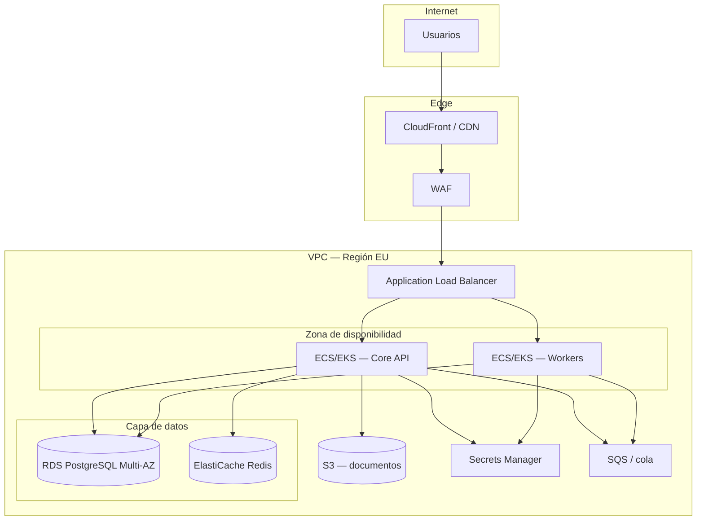

| Componente | Configuración MVP | Notas |
| ---------- | ----------------- | ----- |
| **Compute** | 2–4 instancias API + 2 workers autoscaling | Separar workers evita que jobs IA degraden CRUD |
| **RDS PostgreSQL** | Multi-AZ, backups automáticos | RPO ≤ 1 h, RTO ≤ 4 h (RNF-24) |
| **Redis** | Cluster pequeño | Cache + cola ligera si no se usa SQS |
| **S3** | Bucket por entorno; SSE-KMS | CVs y adjuntos |
| **Secrets** | Tokens Slack, LLM, SMTP | Nunca en repositorio; `IntegrationConfig.secrets_ref` |
| **Observabilidad** | CloudWatch + OpenTelemetry → Grafana/Datadog | RNF-23 |

**Entornos:** `dev` → `staging` → `prod`; un schema por entorno; datos de prueba anonimizados en no-prod.

### 17.6 Flujos arquitectónicos clave

#### Flujo A — Generar plan Autopilot (CU-02, RNF-02)

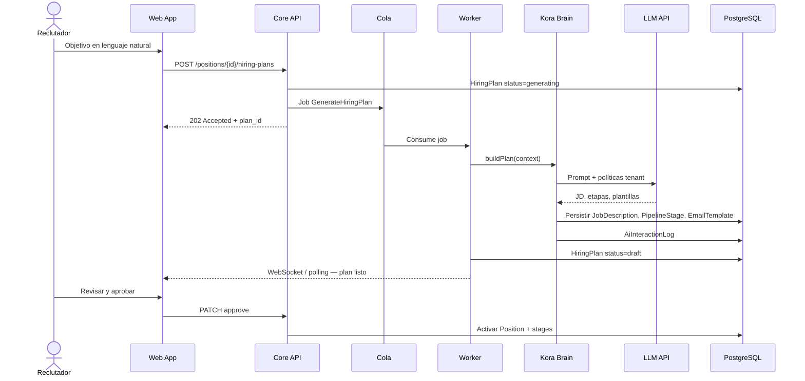

Patrón: **request asíncrono + polling/WebSocket** para no violar timeout del gateway en generaciones largas.

#### Flujo B — Evaluación manager Lite View (CU-03)

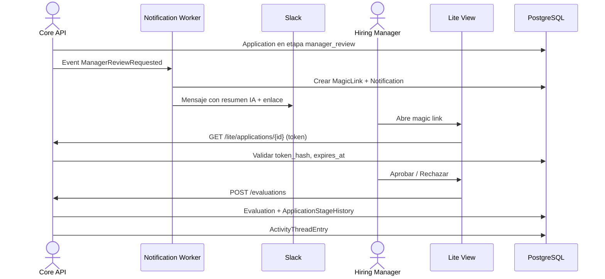

#### Flujo C — Matching talent pool (RF-18, RNF-03)

1. Evento `PositionActivated` o `HiringPlanApproved` encola job `ComputeTalentPoolMatches`.
2. Worker lee candidatos del tenant (`Candidate` + `CandidateProfile`).
3. Kora Brain calcula score + `explanation` JSON; persiste `TalentPoolMatch`.
4. Si score > umbral en `Organization.settings`, notificación al reclutador.

Matching pesado: ejecutar en worker; cachear top-N en Redis con TTL corto para UI.

### 17.7 Seguridad y cumplimiento (vista transversal)

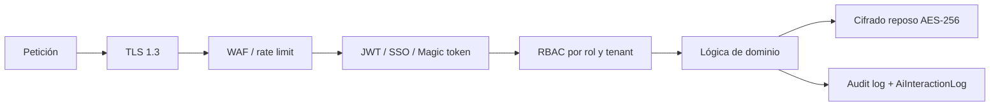

| Control | Implementación |
| ------- | -------------- |
| Autenticación usuarios | OIDC/SAML (RNF-08); MFA para `admin` |
| Lite View | Token opaco de un solo uso; hash en BD; TTL corto |
| Autorización | RBAC: reclutador (tenant completo), manager (solo `Application` asignadas), admin (config) |
| Datos personales | GDPR: consentimiento en `Candidate`; job de anonimización; retención configurable (RNF-11) |
| IA responsable | Sin auto-rechazo sin humano (RNF-13); explicabilidad en respuestas API (RNF-12) |

### 17.8 Contratos e integración entre capas

| Frontera | Contrato | Formato |
| -------- | -------- | ------- |
| Cliente ↔ API | REST + OpenAPI 3.0 | JSON; paginación cursor-based |
| API ↔ Kora Brain | Interface interna `BrainService` | DTOs de dominio; sin exponer prompts al cliente |
| API ↔ Cola | Eventos de dominio | `HiringPlanRequested`, `StageEntered`, `SlaBreached` |
| Workers ↔ Integraciones | Adaptadores | Slack Events API + webhooks; SMTP/OAuth2 |
| API ↔ Storage | Pre-signed URLs | Subida directa de CV a S3 desde cliente |

### 17.9 Stack tecnológico de referencia (MVP)

| Capa | Opción recomendada | Alternativa |
| ---- | ------------------ | ----------- |
| Frontend | Next.js 14+ (App Router) | Remix |
| API | NestJS (TypeScript) | Spring Boot 3 |
| ORM | Prisma o TypeORM | jOOQ |
| Cola | AWS SQS + Lambda/ECS workers | BullMQ (Redis) |
| Búsqueda pool | PostgreSQL full-text + GIN | OpenSearch (si >10k perfiles/tenant) |
| IA | Abstracción sobre OpenAI / Azure OpenAI | Anthropic vía mismo adapter |
| IaC | Terraform | Pulumi |
| CI/CD | GitHub Actions | GitLab CI |

### 17.10 Trazabilidad arquitectura ↔ producto

| Módulo producto | Contenedor / módulo software | Persistencia |
| --------------- | ---------------------------- | ------------ |
| Recruiting Autopilot | Autopilot Module + Kora Brain + Worker | §16 HiringPlan* |
| Manager Collaboration Layer | Collaboration + Integrations + Lite View | §16 Evaluation*, Notification* |
| Talent Pool Intelligence | Talent Pool Module + Worker matching | §16 CandidateProfile, TalentPoolMatch |
| Kora Brain | Brain Orchestrator + AiInteractionLog | Transversal |
| ATS base | ATS Core Module | §16 core entities |
| Hiring Health Score | Queries/agregaciones sobre ATS + Collaboration | Sin tabla dedicada v1 (§16.7) |

### 17.11 Evolución prevista (post-MVP)

| Fase | Evolución arquitectónica |
| ---- | ------------------------ |
| **Fase 2 — Beta** | Escalar workers; feature flags por tenant; métricas O1–O6 en data warehouse ligero |
| **Fase 3 — GA** | Extraer **Notification Service** y **Kora Brain** si carga IA > 30% CPU; API pública para partners |
| **Futuro** | Smart Inbox, transcripción entrevistas → nuevos contenedores sin romper módulos existentes |

### 17.12 Riesgos arquitectónicos y mitigaciones

| Riesgo | Mitigación |
| ------ | ---------- |
| Latencia LLM | Jobs asíncronos; timeouts con regeneración (CU-02 excepción) |
| Acoplamiento Slack | Adaptador en Integrations Module; contratos estables |
| Crecimiento monolito | Límites de módulo estrictos; eventos de dominio desde Fase 1 |
| Coste LLM por tenant | Cuotas en `Organization.settings`; cache de planes similares |
| Fuga multi-tenant | Middleware `TenantContext` obligatorio en cada query |

### 17.13 Modelo C4 en profundidad — CU-02 (Generar y activar plan de contratación)

Zoom arquitectónico del caso de uso **CU-02** y su inclusión **CU-02a** (§15), alineado con US-01, RF-01–RF-07, RNF-02 y flujo A (§17.6). El modelo C4 de Simon Brown define cuatro niveles; aquí se documentan **Contexto → Contenedores → Componentes → Código (interfaces)** para el subsistema *Recruiting Autopilot*.

#### Alcance y fronteras

| Elemento | Definición en este zoom |
| -------- | ------------------------ |
| **Sistema en foco** | Capacidad *Recruiting Autopilot* dentro de Kora |
| **Actores** | Reclutador (primario), Kora Brain vía LLM (secundario) |
| **In scope** | Generación asíncrona del plan, edición, aprobación, activación de posición/pipeline, disparo de matching pool (RF-06) |
| **Out of scope CU-02** | Lite View (CU-03), nudges, publicación en job boards externos |

**Fases del CU-02:** (1) Solicitar generación → (2) Generar borrador IA → (3) Revisar/editar/regenerar → (4) Aprobar y activar (CU-02a) → (5) Post-activación: matching talent pool (RF-06).

---

#### C4 Nivel 1 — Diagrama de contexto (CU-02)

Muestra el sistema de Autopilot en su entorno y las dependencias externas mínimas para completar el caso de uso.

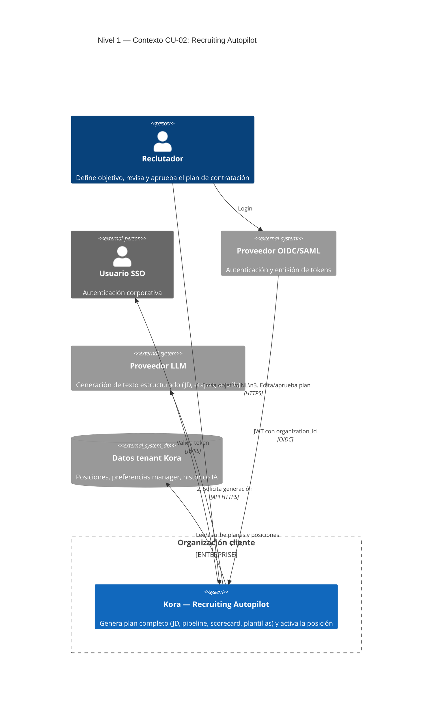

| Relación | Protocolo / dato |
| -------- | ---------------- |
| Reclutador → Autopilot | UI web; JSON REST |
| Autopilot → LLM | API con prompts; salida JSON validada |
| Autopilot → Datos tenant | PostgreSQL §16; aislamiento `organization_id` |

---

#### C4 Nivel 2 — Diagrama de contenedores (CU-02)

Contenedores ejecutables que participan **exclusivamente o principalmente** en CU-02.

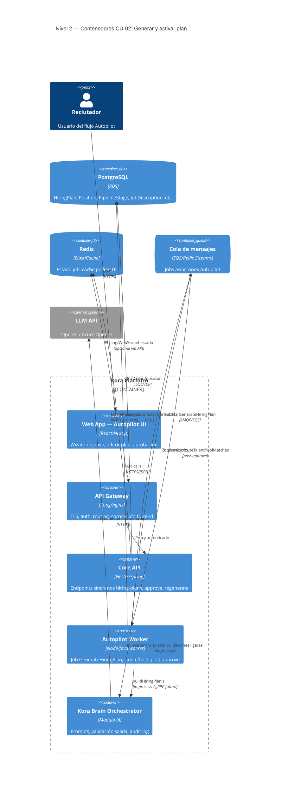

| Contenedor | Responsabilidad en CU-02 | Endpoints / jobs clave |
| ---------- | ------------------------ | ---------------------- |
| **Autopilot UI** | Captura objetivo, plazo, presupuesto; muestra borrador; acciones editar/regenerar/aprobar | — |
| **Core API** | Orquestación síncrona; validación RBAC; transición de estados | `POST/GET/PATCH /positions/{id}/hiring-plans` |
| **Autopilot Worker** | Generación IA larga; materialización de entidades | `GenerateHiringPlan`, `OnHiringPlanApproved` |
| **Kora Brain** | Prompting, parseo, explicabilidad, `AiInteractionLog` | `BrainService.buildHiringPlan()` |
| **Cola** | Desacoplar RNF-02 | Eventos de dominio |
| **PostgreSQL** | Fuente de verdad §16 | Transacción en approve (CU-02a) |

---

#### C4 Nivel 3 — Diagrama de componentes (CU-02)

Descomposición dentro de **Core API**, **Autopilot Worker** y **Kora Brain** para las fases del caso de uso.

```mermaid
C4Component
    title Nivel 3 — Componentes CU-02 (Core API + Worker + Brain)

    Container(api, "Core API", "NestJS/Spring", "API REST") {
        Component(plan_ctrl, "HiringPlanController", "REST", "POST generar, GET estado, PATCH editar/aprobar")
        Component(plan_svc, "HiringPlanApplicationService", "Dominio", "Reglas de estado, autorización, enqueue")
        Component(activate_svc, "PlanActivationService", "Dominio", "CU-02a: activa Position y PipelineStage")
        Component(plan_repo, "HiringPlanRepository", "Persistencia", "HiringPlan, JobDescription, EmailTemplate")
        Component(pos_repo, "PositionRepository", "Persistencia", "Position, PipelineStage, Scorecard")
        Component(event_pub, "DomainEventPublisher", "Infra", "Publica a cola")
        Component(tenant_ctx, "TenantContextMiddleware", "Cross-cutting", "Inyecta organization_id")
    }

    Container(worker, "Autopilot Worker", "Worker process") {
        Component(gen_consumer, "GenerateHiringPlanHandler", "Job handler", "Fase 2: orquesta generación")
        Component(approve_consumer, "HiringPlanApprovedHandler", "Job handler", "Fase 5: encola matching RF-06")
        Component(materializer, "PlanArtifactMaterializer", "Dominio", "Persiste JD, stages, templates, scorecard")
    }

    Container(brain, "Kora Brain Orchestrator", "IA") {
        Component(brain_svc, "BrainService", "Fachada", "buildHiringPlan, regenerate")
        Component(ctx_enricher, "TenantContextEnricher", "IA", "Settings org + ManagerPreferenceProfile")
        Component(prompt_reg, "PromptTemplateRegistry", "IA", "Plantillas validadas por locale/tono")
        Component(llm_adapter, "LlmProviderAdapter", "IA", "Abstracción proveedor")
        Component(output_val, "StructuredOutputValidator", "IA", "JSON schema JD/stages/emails")
        Component(audit_log, "AiAuditLogger", "Compliance", "AiInteractionLog RF-25")
    }

    ContainerDb(db, "PostgreSQL", "BD") {
        ComponentDb(tables, "Tablas §16", "HiringPlan*, Position*, Scorecard")
    }

    Rel(plan_ctrl, plan_svc, "Delega")
    Rel(plan_svc, tenant_ctx, "Usa")
    Rel(plan_svc, plan_repo, "CRUD borrador")
    Rel(plan_svc, event_pub, "enqueue GenerateHiringPlan")
    Rel(plan_svc, activate_svc, "approve()")
    Rel(activate_svc, pos_repo, "Activa pipeline")
    Rel(activate_svc, event_pub, "HiringPlanApproved")
    Rel(event_pub, gen_consumer, "Job")
    Rel(gen_consumer, brain_svc, "buildHiringPlan")
    Rel(brain_svc, ctx_enricher, "Enriquece contexto")
    Rel(brain_svc, prompt_reg, "Selecciona template")
    Rel(brain_svc, llm_adapter, "Completion")
    Rel(brain_svc, output_val, "Valida")
    Rel(brain_svc, audit_log, "Registra")
    Rel(gen_consumer, materializer, "Persiste artefactos")
    Rel(materializer, tables, "INSERT/UPDATE")
    Rel(plan_repo, tables, "SQL")
    Rel(approve_consumer, event_pub, "ComputeTalentPoolMatches")
```

| Componente | Fase CU-02 | RF / RNF |
| ---------- | ---------- | -------- |
| `HiringPlanController` | 1, 3, 4 | RF-01, RF-07 |
| `HiringPlanApplicationService` | 1–4 | RF-07, RNF-09 |
| `GenerateHiringPlanHandler` | 2 | RF-02–RF-04, RNF-02 |
| `BrainService` | 2, 3 (regenerar) | RF-22–RF-25 |
| `PlanActivationService` | 4 (CU-02a) | RF-03, RF-07 |
| `PlanArtifactMaterializer` | 2 | RF-02–RF-05 |
| `HiringPlanApprovedHandler` | 5 | RF-06, US-02 |

---

#### C4 Nivel 4 — Interfaces y contratos (zoom código)

Interfaces públicas e internas del subsistema Autopilot (sin implementación).

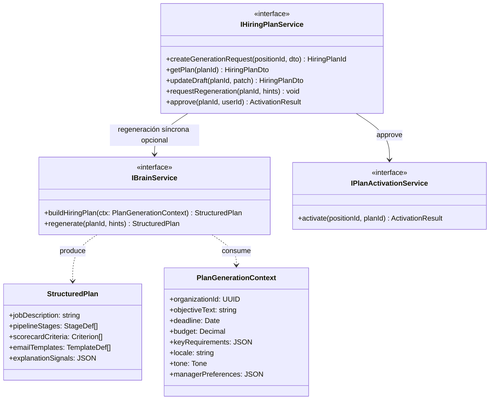

**DTO de salida `StructuredPlan`:** validado por `StructuredOutputValidator` antes de persistir; si falla validación → reintento LLM (máx. N) o estado `generating_failed` editable manualmente (excepción CU-02 §15.1).

---

#### Diagrama de estados — `HiringPlan` y `Position` (CU-02)

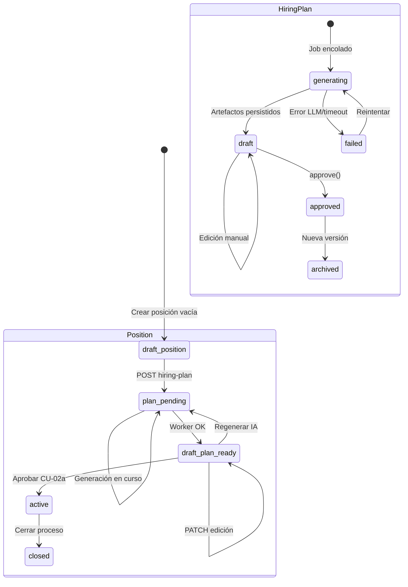

---

#### Secuencia detallada — CU-02 completo (5 fases)

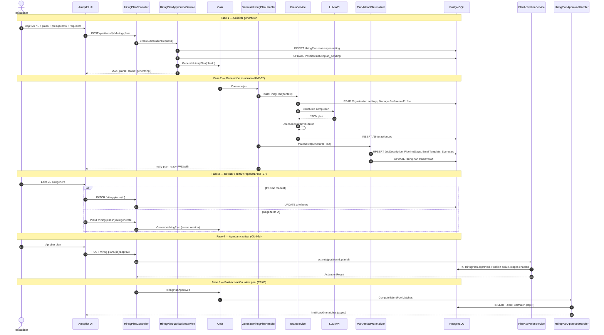

---

#### API REST del subsistema (contrato CU-02)

| Método | Ruta | Fase | Descripción |
| ------ | ---- | ---- | ----------- |
| `POST` | `/api/v1/positions/{positionId}/hiring-plans` | 1 | Inicia generación; body: `objectiveText`, `deadline`, `budget`, `keyRequirements` |
| `GET` | `/api/v1/hiring-plans/{planId}` | 2–3 | Devuelve plan + artefactos anidados |
| `GET` | `/api/v1/hiring-plans/{planId}/status` | 2 | Ligero para polling: `generating` \| `draft` \| `failed` |
| `PATCH` | `/api/v1/hiring-plans/{planId}` | 3 | Edición manual JD, stages, templates |
| `POST` | `/api/v1/hiring-plans/{planId}/regenerate` | 3 | Nueva versión IA; opcional `hints` |
| `POST` | `/api/v1/hiring-plans/{planId}/approve` | 4 | CU-02a; activa posición |
| `GET` | `/api/v1/positions/{positionId}/talent-pool-matches` | 5 | Top N matches tras activación (RF-06) |

---

#### Eventos de dominio (cola)

| Evento | Productor | Consumidor | Efecto |
| ------ | --------- | ---------- | ------ |
| `GenerateHiringPlan` | `HiringPlanApplicationService` | `GenerateHiringPlanHandler` | Fase 2 |
| `HiringPlanApproved` | `PlanActivationService` | `HiringPlanApprovedHandler` | Encola matching RF-06 |
| `ComputeTalentPoolMatches` | `HiringPlanApprovedHandler` | Talent Pool Worker | US-02 / RF-18 |

---

#### PlantUML C4 (referencia exportable)

```plantuml
@startuml c4-cu02-context
!include https://raw.githubusercontent.com/plantuml-stdlib/C4-PlantUML/master/C4_Context.puml

title Nivel 1 — Contexto CU-02

Person(recruiter, "Reclutador", "Aprueba plan de contratación")
System(autopilot, "Recruiting Autopilot", "Genera y activa planes")
System_Ext(llm, "LLM API", "Generación IA")

Rel(recruiter, autopilot, "Define objetivo y aprueba")
Rel(autopilot, llm, "Genera JD, pipeline, plantillas")
@enduml
```

---

#### Trazabilidad C4 CU-02 ↔ artefactos del PRD

| Nivel C4 | Artefacto | Cubre |
| -------- | --------- | ----- |
| Contexto | Actores Reclutador + LLM | CU-02, §15.1 actores |
| Contenedores | UI, API, Worker, Brain, BD, Cola | §17.3 reducido a CU-02 |
| Componentes | 12 componentes nombrados | RF-01–07, CU-02a, RF-06 |
| Código (interfaces) | `IHiringPlanService`, `IBrainService` | Contratos §17.8 |
| Estados + secuencia | 5 fases | US-01 criterios, RNF-02, excepción timeout |

---

_Documento generado a partir de la sesión de brainstorming y diseño producto LTI/Kora. Versión 1.0 — pendiente de revisión técnica y validación con stakeholders._
